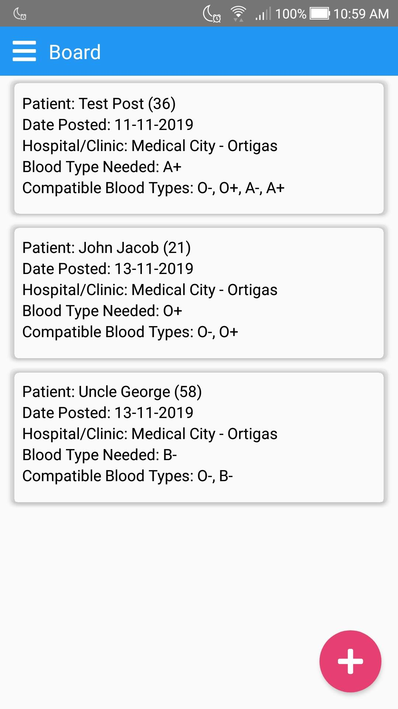
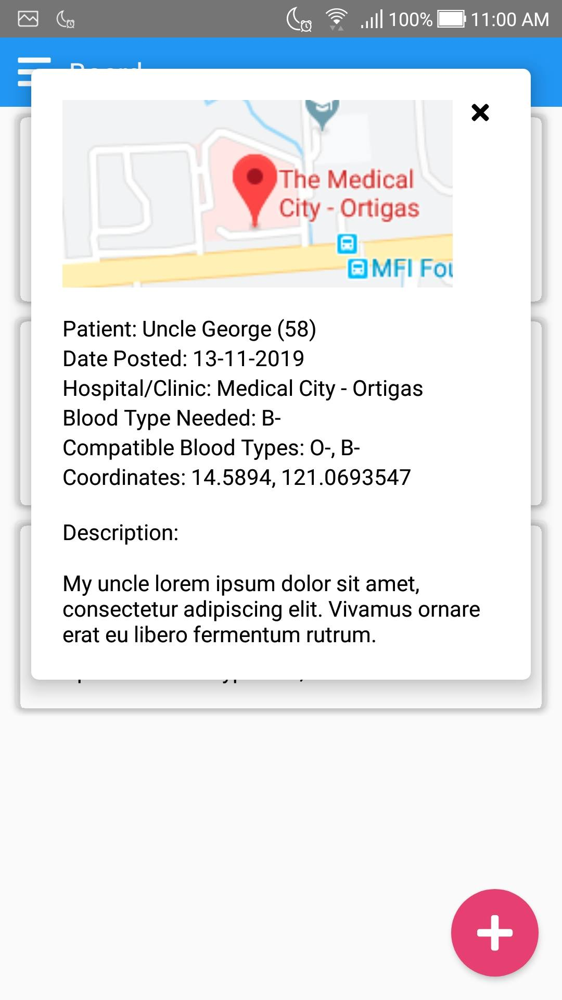
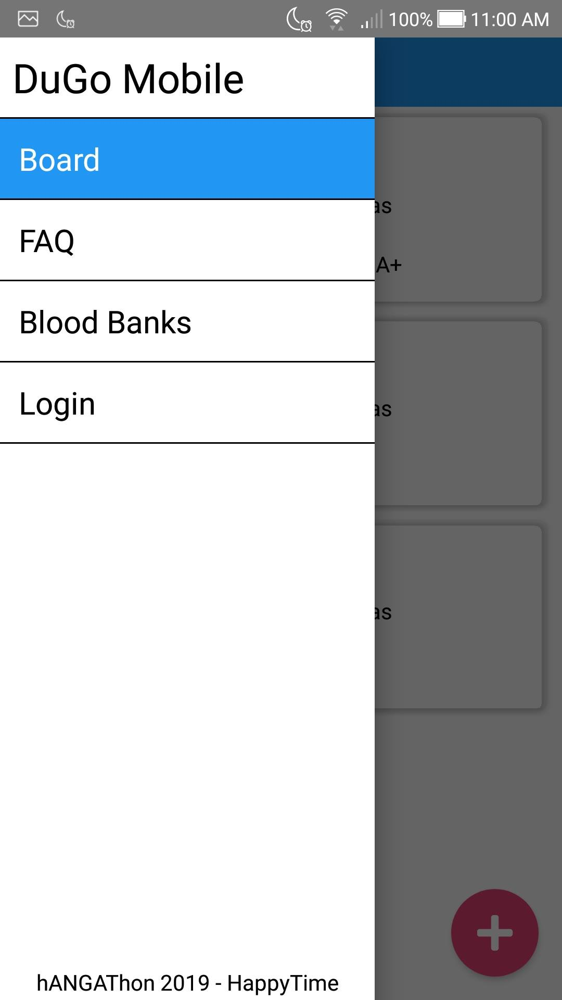
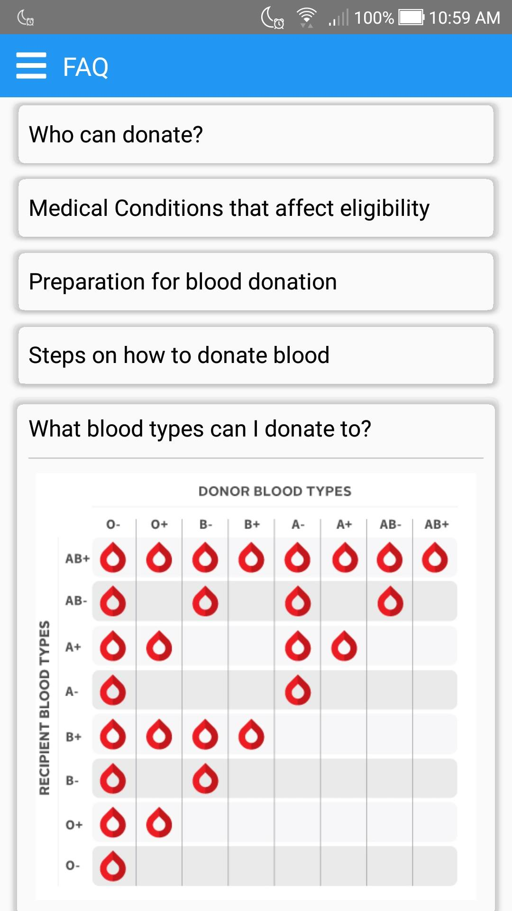

## hANGAThon 2019 - The Philippines: Debugged

### Team HappyTime
- Ethan Sonza
- Kiara Sonza
- Mark Rodriguez

## DuGo - Blood Donation Platform [Healthcare]

### Problem
- Looking for volunteer blood donations has been a struggle as the reach of social media posts are often unseen and limited to one's connections

### Solution
- A platform for those looking for blood donations and for volunteers willing to donate blood
- People looking for blood will be able to create posts and express themselves directly to blood donors
- Posts will have more reach as it will be on a platform for those specifically catered to those who are willing blood donors
- Blood donors will be able to appreciate more of their donations, since they are able to meet and help strangers

### Features
- [x] Board of posts looking for blood donations
- [x] FAQ Section
- [ ] Post will have the location marked on a map
- [ ] Filter posts with user's eligible bloodtype
- [ ] View posts within their vicinity
- [ ] List of Blood Banks within vicinity
- [ ] In-app messaging feature
- [ ] TODO: Complete CRUD for Posts and Profile

#### Notes
- Features involving maps/vicinities are not checked because the Map integration has yet to be implemented
- Other features are tasks we intend to add in the future

### Technology
- Rails 5
- ReactNative 61

### Screenshots

#### Board of Posts

#### Post (Temp)

#### Drawer

#### FAQ

#### Blood Banks
